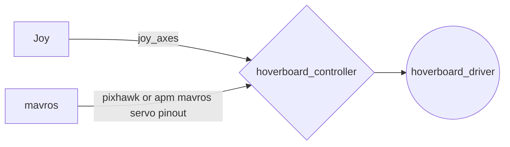

# yildiz_tarim_hoverboard_controller
you control with this package mavros and hoverbord-driver with ros hoverboard-driver ,mavros and joy controller package 

you download your workspace [hoverboard-driver](https://github.com/alex-makarov/hoverboard-driver) and mavros for pixhawk or ardupilot

